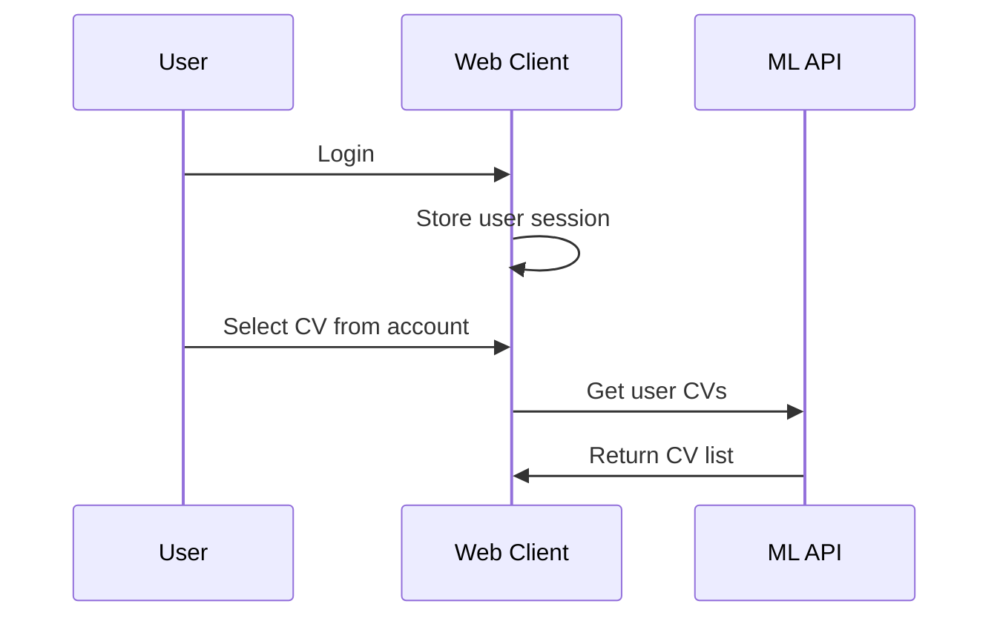
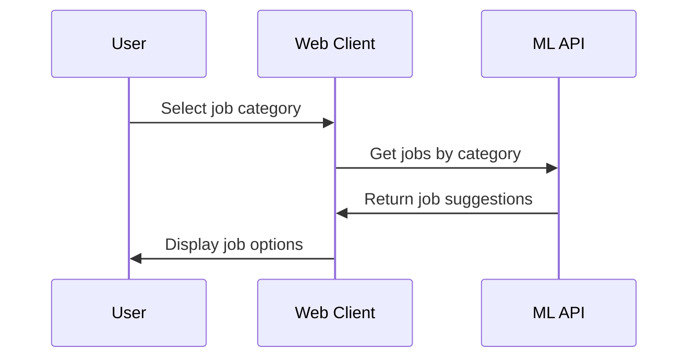
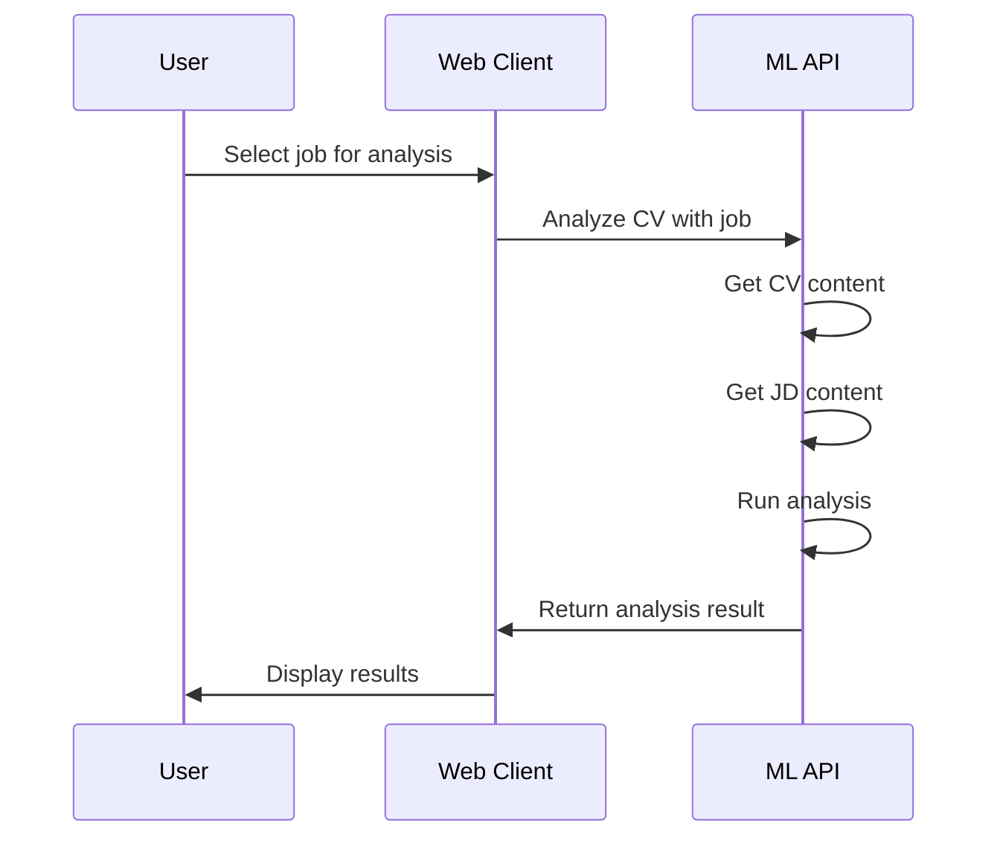

# 🔄 **Web Client Integration Guide**

## 📋 **Tổng quan luồng hệ thống mới**

### **🔄 Luồng cũ:**

```
User → Upload CV File → Select Job Category → Input JD Text → Analysis
```

### **🆕 Luồng mới:**

```
User (Web Client) → Select CV from Account → Select Job Category → Auto JD Import → Analysis
```

---

## 🚀 **API Endpoints mới**

### **1. `/analyze-cv-from-web-client` (POST)**

**Phân tích CV với JD được import tự động**

```json
{
  "user_id": "user_123",
  "cv_id": "cv_456",
  "job_id": "job_789",
  "job_category": "INFORMATION-TECHNOLOGY",
  "job_position": "FULLSTACK_DEVELOPER"
}
```

**Response:**

```json
{
  "cv_analysis": {...},
  "jd_analysis": {...},
  "matching_analysis": {
    "matching_skills": [...],
    "missing_skills": [...],
    "skills_match_score": 85.5
  },
  "quality_analysis": {...},
  "scores": {"ats_score": 75, "overall_score": 82},
  "feedback": "LLM-generated intelligent feedback"
}
```

### **2. `/analyze-cv-with-job` (POST)**

**Phân tích CV với job suggestions tự động**

```json
{
  "user_id": "user_123",
  "cv_id": "cv_456",
  "job_category": "INFORMATION-TECHNOLOGY",
  "job_position": "FULLSTACK_DEVELOPER"
}
```

**Response:**

```json
{
  "user_id": "user_123",
  "cv_id": "cv_456",
  "job_category": "INFORMATION-TECHNOLOGY",
  "suggested_analyses": [
    {
      "job_id": "job_1",
      "job_title": "Full Stack Developer",
      "company_name": "Tech Company A",
      "analysis": {...}
    },
    {
      "job_id": "job_2",
      "job_title": "Backend Developer",
      "company_name": "Tech Company B",
      "analysis": {...}
    }
  ]
}
```

### **3. `/get-user-cv/{user_id}/{cv_id}` (GET)**

**Lấy thông tin CV của user**

### **4. `/get-job-posting/{job_id}` (GET)**

**Lấy thông tin job posting**

---

## ⚙️ **Cấu hình hệ thống**

### **Environment Variables:**

```bash
# Web Client Integration
WEB_CLIENT_URL=https://khoaluanai.vercel.app
WEB_CLIENT_API_KEY=your_api_key_here
INTEGRATION_MODE=mock  # or 'real'

# Request Settings
REQUEST_TIMEOUT=30
MAX_RETRIES=3
RETRY_DELAY=1

# Cache Settings
CACHE_ENABLED=true
CACHE_TTL=300
```

### **Job Categories:**

```python
JOB_CATEGORIES = {
    "INFORMATION-TECHNOLOGY": {
        "name": "Công nghệ thông tin",
        "subcategories": [
            "SOFTWARE_DEVELOPER",
            "FULLSTACK_DEVELOPER",
            "BACKEND_DEVELOPER",
            "FRONTEND_DEVELOPER",
            "MOBILE_DEVELOPER",
            "DEVOPS_ENGINEER",
            "DATA_SCIENTIST",
            "MACHINE_LEARNING_ENGINEER",
            "SYSTEM_ADMINISTRATOR",
            "QA_ENGINEER"
        ]
    },
    "MARKETING": {...},
    "FINANCE": {...},
    "HUMAN_RESOURCES": {...},
    "DESIGN": {...}
}
```

---

## 🔧 **Implementation Details**

### **1. Web Client Integration Service**

```python
from ml_architecture.services.web_client_integration import WebClientIntegration, MockWebClientIntegration

# Development mode (mock data)
web_client = MockWebClientIntegration()

# Production mode (real API calls)
web_client = WebClientIntegration()
```

### **2. Mock Data Structure**

```python
mock_cvs = {
    "user_1": {
        "cv_1": {
            "content": "CV content here...",
            "filename": "cv_nguyen_van_a.pdf",
            "upload_date": "2024-01-01"
        }
    }
}

mock_jobs = {
    "job_1": {
        "job_title": "Full Stack Developer",
        "company_name": "Tech Company A",
        "job_description": "Job description...",
        "job_requirements": "Requirements..."
    }
}
```

### **3. Error Handling**

```python
try:
    cv_content = await web_client.get_cv_content(user_id, cv_id)
    if not cv_content:
        raise HTTPException(404, "CV not found")
except Exception as e:
    logger.error(f"Error getting CV: {e}")
    raise HTTPException(500, "Internal server error")
```

---

## 🧪 **Testing**

### **1. Test với Mock Data:**

```bash
# Set environment
export INTEGRATION_MODE=mock

# Test API
curl -X POST "http://localhost:8000/analyze-cv-from-web-client" \
  -H "Content-Type: application/json" \
  -d '{
    "user_id": "user_1",
    "cv_id": "cv_1",
    "job_id": "job_1",
    "job_category": "INFORMATION-TECHNOLOGY",
    "job_position": "FULLSTACK_DEVELOPER"
  }'
```

### **2. Test với Real Web Client:**

```bash
# Set environment
export INTEGRATION_MODE=real
export WEB_CLIENT_URL=https://khoaluanai.vercel.app
export WEB_CLIENT_API_KEY=your_api_key

# Test API
curl -X POST "http://localhost:8000/analyze-cv-with-job" \
  -H "Content-Type: application/json" \
  -d '{
    "user_id": "real_user_id",
    "cv_id": "real_cv_id",
    "job_category": "INFORMATION-TECHNOLOGY"
  }'
```

---

## 📊 **Luồng hoạt động chi tiết**

### **Bước 1: User Authentication**



### **Bước 2: Job Category Selection**



### **Bước 3: CV Analysis**



---

## 🔄 **Migration từ luồng cũ sang mới**

### **1. Backward Compatibility:**

```python
# Vẫn giữ endpoint cũ
@app.post("/analyze-cv")
async def analyze_cv(
    cv_file: UploadFile = File(...),
    job_category: str = Form(...),
    job_position: str = Form(...),
    jd_text: str = Form(...)
):
    # Existing implementation
    pass

# Thêm endpoint mới
@app.post("/analyze-cv-from-web-client")
async def analyze_cv_from_web_client(request: WebClientAnalysisRequest):
    # New implementation
    pass
```

### **2. Gradual Migration:**

1. **Phase 1**: Deploy new endpoints alongside old ones
2. **Phase 2**: Update web client to use new endpoints
3. **Phase 3**: Deprecate old endpoints
4. **Phase 4**: Remove old endpoints

---

## 🚀 **Deployment**

### **1. Environment Setup:**

```bash
# Development
export INTEGRATION_MODE=mock
export WEB_CLIENT_URL=https://khoaluanai.vercel.app

# Production
export INTEGRATION_MODE=real
export WEB_CLIENT_API_KEY=your_production_api_key
export WEB_CLIENT_URL=https://khoaluanai.vercel.app
```

### **2. Docker Deployment:**

```dockerfile
# Add to Dockerfile
ENV INTEGRATION_MODE=mock
ENV WEB_CLIENT_URL=https://khoaluanai.vercel.app
```

### **3. Render Deployment:**

```yaml
# render.yaml
services:
  - type: web
    name: cv-analysis-api
    env: python
    plan: free
    buildCommand: pip install -r requirements.txt
    startCommand: python start_server.py
    envVars:
      - key: INTEGRATION_MODE
        value: mock
      - key: WEB_CLIENT_URL
        value: https://khoaluanai.vercel.app
```

---

## 📈 **Monitoring & Analytics**

### **1. API Metrics:**

- Request count per endpoint
- Response time
- Error rate
- User engagement

### **2. Business Metrics:**

- Analysis completion rate
- Job match success rate
- User satisfaction score
- Feature adoption rate

---

## 🔮 **Future Enhancements**

### **1. Real-time Notifications:**

- WebSocket integration
- Push notifications
- Email alerts

### **2. Advanced Analytics:**

- User behavior tracking
- Performance insights
- A/B testing

### **3. Machine Learning:**

- Personalized job suggestions
- Skill gap analysis
- Career path recommendations

---

## 📞 **Support & Troubleshooting**

### **Common Issues:**

1. **CV not found**: Check user_id and cv_id
2. **Job not found**: Verify job_id exists
3. **API timeout**: Increase REQUEST_TIMEOUT
4. **Authentication error**: Verify API key

### **Debug Mode:**

```bash
export DEBUG_MODE=true
export LOG_LEVEL=DEBUG
```

---

**🎯 Luồng hệ thống mới đã sẵn sàng để tích hợp với web client!**
